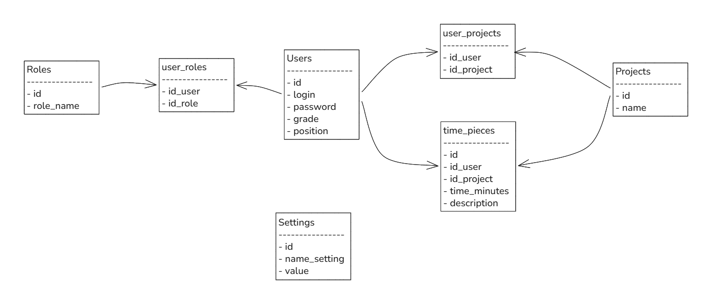

# Проект трекера рабочего времени

### Общее описание

Существуют сотрудники компании и проекты. Сотрудник может работать на нескольких проектах,
на проекте может работать несколько сотрудников. Сотрудник каждый день учитывает время до 00:00 за этот день.
Ограничение: учесть можно не больше 24 часов в день и не меньше 0. При учете часов сотрудник отправляет форму:
проект, количество времени, что делал, дата. Можно редактировать записи и удалять их.
Администратор может выставить верхнюю и нижнюю отсечку учета времени, максимальное и минимальное количество
часов для учета в день, работать со всеми записями учтенного времени, может фильтровать записи (по человеку, по
проекту, "незакрытые дни").

### Роли:

- Работник:
    - входит/выходит в сервис
    - может выбрать из доступных проектов и добавить запись о проделанной работе
    - удаление/редактирование записей
- Админ:
    - входит/выходит в сервис
    - заводит новых работников
    - редактирует старых работников
    - перепривязывает их к проектам
    - может сортировать общие показатели
    - выставляет ограничения по учету времени

### Сущности:

